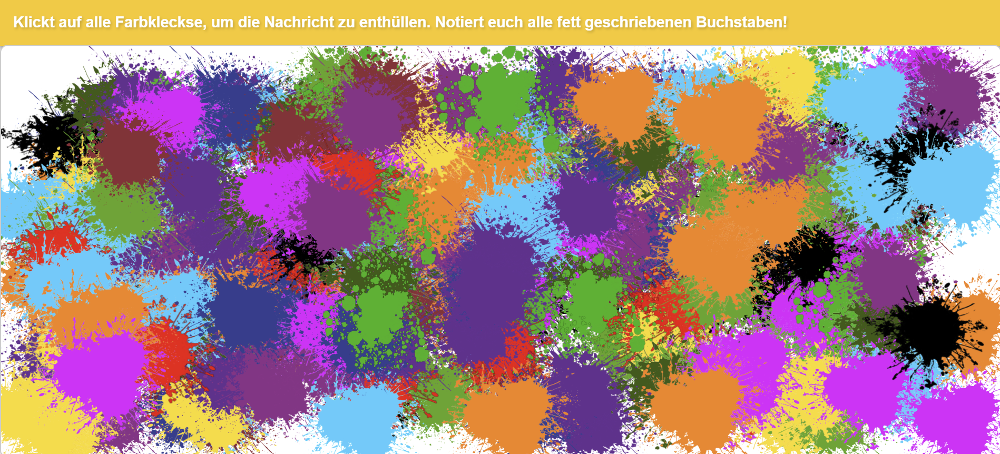

# Farbklecks Spiel
Small interactive game where users have to click on colored blobs to reveal the background. Includes playful character interactions and sound effects
[Click here to try out](https://stjume.github.io/FarbklecksSpiel/)



---

# Usage
- Open der url of the game with your tablet.

- There are several colored blobs in the beginning.

- Clicking on a blob makes it disappear or reappear in a new position.

- The goal is to remove all the blobs and reveal the hidden background.

---

## Features

* Tablet-first responsive design
* Dynamic blob scaling based on screen size
* Randomized blob placement and sizing
* Mouse and touch input support
* Event-based character popups ("Ätsch!" / "Menno!")
* Randomized sound effects for character taunts
* No external dependencies

---

## Requirements

* Modern web browser
* JavaScript enabled

No external dependencies required.

---

## Development Setup

Clone the repository:

```bash
git clone https://github.com/stjume/FarbklecksSpiel.git
```

Open `index.html` directly in a browser
or run a simple local web server for development.

Using **VS Code Live Server** is recommended.

---

## Deployment

No backend, database, or complex runtime environment required.

Simply host the static project files on any basic web server and the game is ready to use.

Example hosting options:

* GitHub Pages
* Apache
* Nginx
* Local web server
* Any static hosting provider
